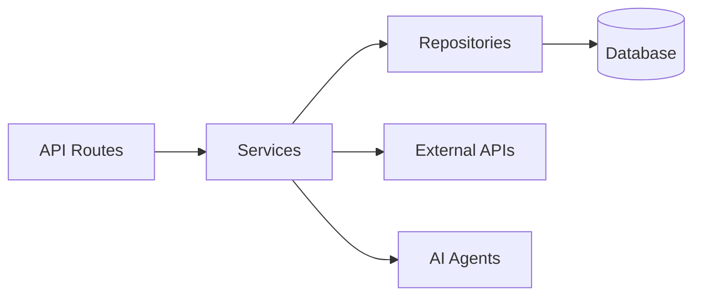

<div align="center">

<br>

<h1>
  ⚡ AI Agent CodeSommet ⚡
</h1>

<h3>
  <i>The ultimate production-ready FastAPI + Next.js generator</i>
</h3>

<p>
  <i>AI agents · RAG · WebSocket streaming · 20+ enterprise integrations — all configured and ready to ship.</i>
</p>

<br>

<p>
  <a href="#-quick-start"></a>
  <a href="#-features"></a>
  <a href="#-architecture"></a>
  <a href="#-faq"></a>
</p>

<p>
  
  
  
  
  
</p>

<br>

<table align="center">
<tr>
<td align="center">🤖 <b>5 AI Frameworks</b><br><sub>PydanticAI · LangChain · LangGraph · CrewAI · DeepAgents</sub></td>
<td align="center">📚 <b>4 Vector Stores</b><br><sub>Milvus · Qdrant · pgvector · ChromaDB</sub></td>
</tr>
<tr>
<td align="center">⚡ <b>FastAPI + Next.js 15</b><br><sub>WebSocket streaming · Real-time chat UI</sub></td>
<td align="center">🔒 <b>Enterprise-Ready</b><br><sub>JWT · OAuth · Admin · Celery · Docker · K8s</sub></td>
</tr>
</table>

<br>

</div>

---

## 📚 Table of Contents

<details>
<summary><b>Click to expand</b></summary>

- [🚀 Quick Start](#-quick-start)
- [🎯 Why This Template](#-why-this-template)
- [✨ Features](#-features)
- [🏗️ Architecture](#-architecture)
- [🤖 AI Agent](#-ai-agent)
- [📄 RAG (Retrieval-Augmented Generation)](#-rag-retrieval-augmented-generation)
- [📊 Observability](#-observability)
- [🛠️ Django-style CLI](#-django-style-cli)
- [📁 Generated Project Structure](#-generated-project-structure)
- [⚙️ Configuration Options](#-configuration-options)
- [🔄 Comparison](#-comparison)
- [❓ FAQ](#-faq)
- [🤝 Contributing](#-contributing)
- [📄 License](#-license)

</details>

---

## 🚀 Quick Start

### 📦 Installation

```bash
# pip
pip install ai-agent-codesommet

# uv (recommended)
uv tool install ai-agent-codesommet

# pipx
pipx install ai-agent-codesommet
```

### 🎨 Create Your Project

```bash
# Interactive wizard (recommended)
codesommet

# Quick mode with options
codesommet create my_ai_app \
  --database postgresql \
  --frontend nextjs

# Use presets for common setups
codesommet create my_ai_app --preset production   # Full production setup
codesommet create my_ai_app --preset ai-agent     # AI agent with streaming

# Minimal project (no extras)
codesommet create my_ai_app --minimal
```

### ▶️ Start Development

#### 1️⃣ Install dependencies

```bash
cd my_ai_app
make install
```

> [!NOTE]
> **Windows Users:** The `make` command requires GNU Make. Install via [Chocolatey](https://chocolatey.org/) (`choco install make`), use WSL, or run raw commands manually.

#### 2️⃣ Start the database

```bash
make docker-db
```

#### 3️⃣ Create and apply database migrations

> [!WARNING]
> Both commands are required! `db-migrate` creates the migration file, `db-upgrade` applies it.

```bash
make db-migrate     # Enter message: "Initial migration"
make db-upgrade     # Apply migrations to create tables
```

#### 4️⃣ Create admin user

```bash
make create-admin
```

#### 5️⃣ Start the backend

```bash
make run
```

#### 6️⃣ Start the frontend (new terminal)

```bash
cd frontend
bun install
bun dev
```

### 🌐 Access

| Service | URL |
|---------|-----|
| 🔌 **API** | <http://localhost:8000> |
| 📖 **API Docs** | <http://localhost:8000/docs> |
| 🛡️ **Admin Panel** | <http://localhost:8000/admin> |
| 🎨 **Frontend** | <http://localhost:3000> |

---

## 🎯 Why This Template

Building AI/LLM applications requires more than just an API wrapper. You need:

- ✅ **Type-safe AI agents** with tool/function calling
- ✅ **Real-time streaming** responses via WebSocket
- ✅ **Conversation persistence** and history management
- ✅ **Production infrastructure** — auth, rate limiting, observability
- ✅ **Enterprise integrations** — background tasks, webhooks, admin panels

This template gives you all of that out of the box, with **20+ configurable integrations** so you can focus on building your AI product, not boilerplate.

### 💡 Perfect For

| Use Case | Description |
|----------|-------------|
| 🤖 **AI Chatbots & Assistants** | PydanticAI or LangChain agents with streaming responses |
| 📊 **ML Applications** | Background task processing with Celery/Taskiq |
| 🏢 **Enterprise SaaS** | Full auth, admin panel, webhooks, and more |
| 🚀 **Startups** | Ship fast with production-ready infrastructure |

### 🤝 AI-Agent Friendly

Generated projects include **CLAUDE.md** and **AGENTS.md** files optimized for AI coding assistants (Claude Code, Codex, Copilot, Cursor, Zed) — concise project overview with pointers to detailed docs when needed.

---

## ✨ Features

<div align="center">

<p>
  
  
  
  
  
  
  
  
</p>

<p>
  
  
  
  
  
  
</p>

<p>
  
  
  
  
  
  
  
  
  
  
</p>

<p>
  
  
  
  
</p>

</div>

### 🤖 AI/LLM First

- **5 AI Frameworks** — PydanticAI, LangChain, LangGraph, CrewAI, DeepAgents
- **4 LLM Providers** — OpenAI, Anthropic, Google Gemini, OpenRouter
- **RAG** — Document ingestion, vector search, reranking (Milvus, Qdrant, ChromaDB, pgvector)
- **WebSocket Streaming** — Real-time responses with full event access
- **Conversation Persistence** — Save chat history to database
- **Image Description** — Extract images from documents, describe via LLM vision
- **Multimodal Embeddings** — Google Gemini embedding model (text + images)
- **Document Sources** — Local files, API upload, Google Drive, S3/MinIO
- **Sync Sources** — Configurable connectors (Google Drive, S3) with scheduled sync
- **Observability** — Logfire for PydanticAI, LangSmith for LangChain/LangGraph/DeepAgents

### ⚡ Backend (FastAPI)

- **FastAPI** + **Pydantic v2** — High-performance async API
- **Multiple Databases** — PostgreSQL (async), MongoDB (async), SQLite
- **Authentication** — JWT + Refresh tokens, API Keys, OAuth2 (Google)
- **Background Tasks** — Celery, Taskiq, or ARQ
- **Django-style CLI** — Custom management commands with auto-discovery

### 🎨 Frontend (Next.js 15)

- **React 19** + **TypeScript** + **Tailwind CSS v4**
- **AI Chat Interface** — WebSocket streaming, tool call visualization
- **Authentication** — HTTP-only cookies, auto-refresh
- **Dark Mode** + **i18n** (English)

### 🔌 20+ Enterprise Integrations

| Category | Integrations |
|----------|-------------|
| 🤖 **AI Frameworks** | PydanticAI, LangChain, LangGraph, CrewAI, DeepAgents |
| 🧠 **LLM Providers** | OpenAI, Anthropic, Google Gemini, OpenRouter |
| 📚 **RAG / Vector Stores** | Milvus, Qdrant, ChromaDB, pgvector |
| 📥 **RAG Sources** | Local files, API upload, Google Drive, S3/MinIO |
| 🔢 **Embeddings** | OpenAI, Voyage, Gemini (multimodal), SentenceTransformers |
| ⚡ **Caching & State** | Redis, fastapi-cache2 |
| 🔐 **Security** | Rate limiting, CORS, CSRF protection |
| 📊 **Observability** | Logfire, LangSmith, Sentry, Prometheus |
| 🛡️ **Admin** | SQLAdmin panel with auth |
| 📡 **Events** | Webhooks, WebSockets |
| 🚢 **DevOps** | Docker, GitHub Actions, GitLab CI, Kubernetes |

---

## 🏗️ Architecture

```
┌──────────────────────────────────────────────────────────────────────────┐
│                         FRONTEND  (Next.js 15)                           │
│  Chat UI · Knowledge Base · Dashboard · Settings · Dark Mode             │
└──────────────┬───────────────────────────────────────────┬───────────────┘
               │  REST / WebSocket                         │  Vercel
               ▼                                           ▼
┌──────────────────────────────────────────────────────────────────────────┐
│                         BACKEND  (FastAPI)                               │
│                                                                          │
│  ┌─────────────────────────────────────────────────────────────────┐     │
│  │                     AI AGENTS                                   │     │
│  │  PydanticAI · LangChain · LangGraph · CrewAI · DeepAgents       │     │
│  │  ────────────────────────────────────────────────────────────   │     │
│  │  Tools: datetime · web_search (Tavily) · search_knowledge_base  │     │
│  │  Providers: OpenAI · Anthropic · Gemini · OpenRouter            │     │
│  └─────────────────────────────────────────────────────────────────┘     │
│                                                                          │
│  ┌─────────────────────────────────────────────────────────────────┐     │
│  │                     RAG PIPELINE                                │     │
│  │                                                                 │     │
│  │  Sources        Parse           Chunk          Embed            │     │
│  │  ─────────      ──────────      ──────────     ──────────────   │     │
│  │  Local files    PyMuPDF         recursive      OpenAI           │     │
│  │  API upload     LiteParse       markdown       Voyage           │     │
│  │  Google Drive   LlamaParse      fixed          Gemini (multi)   │     │
│  │  S3/MinIO       python-docx                    SentenceTransf.  │     │
│  │                                                                 │     │
│  │  Store              Search              Rank                    │     │
│  │  ──────────────     ──────────────      ──────────────          │     │
│  │  Milvus             Vector similarity   Cohere reranker         │     │
│  │  Qdrant             BM25 + vector RRF   CrossEncoder            │     │
│  │  ChromaDB           Multi-collection                            │     │
│  │  pgvector                                                       │     │
│  └─────────────────────────────────────────────────────────────────┘     │
│                                                                          │
│  Auth (JWT/API Key/OAuth) · Rate Limiting · Webhooks · Admin Panel       │
│  Background Tasks (Celery/Taskiq/ARQ) · Django-style CLI                 │
│  Observability (Logfire/LangSmith/Sentry/Prometheus)                     │
└───────┬──────────────┬──────────────┬──────────────┬─────────────────────┘
        │              │              │              │
        ▼              ▼              ▼              ▼
   PostgreSQL       Redis         Vector DB      LLM APIs
   MongoDB                        (Milvus/       (OpenAI/
   SQLite                         Qdrant/        Anthropic/
                                  ChromaDB/      Gemini)
                                  pgvector)
```

### 🧱 Layered Architecture

The backend follows a clean **Repository + Service** pattern:



| Layer | Responsibility |
|-------|---------------|
| 🌐 **Routes** | HTTP handling, validation, auth |
| ⚙️ **Services** | Business logic, orchestration |
| 💾 **Repositories** | Data access, queries |

---

## 🤖 AI Agent

Choose from **5 AI frameworks** and **4 LLM providers** when generating your project:

```bash
# PydanticAI with OpenAI (default)
codesommet create my_app --ai-framework pydantic_ai

# LangGraph with Anthropic
codesommet create my_app --ai-framework langgraph --llm-provider anthropic

# CrewAI with Google Gemini
codesommet create my_app --ai-framework crewai --llm-provider google

# DeepAgents with OpenAI
codesommet create my_app --ai-framework deepagents

# With RAG enabled
codesommet create my_app --rag --database postgresql --task-queue celery
```

### ✅ Supported Combinations

| Framework | OpenAI | Anthropic | Gemini | OpenRouter |
|-----------|:------:|:---------:|:------:|:----------:|
| **PydanticAI** | ✅ | ✅ | ✅ | ✅ |
| **LangChain** | ✅ | ✅ | ✅ | — |
| **LangGraph** | ✅ | ✅ | ✅ | — |
| **CrewAI** | ✅ | ✅ | ✅ | — |
| **DeepAgents** | ✅ | ✅ | ✅ | — |

### 🎯 PydanticAI Integration

Type-safe agents with full dependency injection:

```python
# app/agents/assistant.py
from pydantic_ai import Agent, RunContext

@dataclass
class Deps:
    user_id: str | None = None
    db: AsyncSession | None = None

agent = Agent[Deps, str](
    model="openai:gpt-4o-mini",
    system_prompt="You are a helpful assistant.",
)

@agent.tool
async def search_database(ctx: RunContext[Deps], query: str) -> list[dict]:
    """Search the database for relevant information."""
    ...
```

### 🔗 LangChain Integration

Flexible agents with LangGraph:

```python
# app/agents/langchain_assistant.py
from langchain.tools import tool
from langgraph.prebuilt import create_react_agent

@tool
def search_database(query: str) -> list[dict]:
    """Search the database for relevant information."""
    ...

agent = create_react_agent(
    model=ChatOpenAI(model="gpt-4o-mini"),
    tools=[search_database],
    prompt="You are a helpful assistant.",
)
```

### 📡 WebSocket Streaming

Both frameworks use the same WebSocket endpoint with real-time streaming:

```python
@router.websocket("/ws")
async def agent_ws(websocket: WebSocket):
    await websocket.accept()

    async for event in agent.stream(user_input):
        await websocket.send_json({
            "type": "text_delta",
            "content": event.content
        })
```

### 👁️ Observability

| Framework | Observability | Dashboard |
|-----------|--------------|-----------|
| 🔵 **PydanticAI** | [Logfire](https://logfire.pydantic.dev) | Agent runs, tool calls, token usage |
| 🟢 **LangChain** | [LangSmith](https://smith.langchain.com) | Traces, feedback, datasets |

---

## 📄 RAG (Retrieval-Augmented Generation)

Enable RAG to give your AI agents access to a knowledge base built from your documents.

### 🗄️ Vector Store Backends

| Backend | Type | Docker Required | Best For |
|---------|------|:---:|---------|
| 🟦 **Milvus** | Dedicated vector DB | ✅ (3 services) | Production, large scale |
| 🟥 **Qdrant** | Dedicated vector DB | ✅ (1 service) | Production, simple setup |
| 🟧 **ChromaDB** | Embedded / HTTP | ❌ | Development, prototyping |
| 🟪 **pgvector** | PostgreSQL extension | ❌ (uses existing PG) | Already have PostgreSQL |

### 📥 Document Ingestion (CLI)

```bash
# Local files
uv run my_app rag-ingest /path/to/document.pdf --collection docs
uv run my_app rag-ingest /path/to/folder/ --recursive

# Google Drive (service account)
uv run my_app rag-sync-gdrive --collection docs --folder-id <drive_folder_id>

# S3/MinIO
uv run my_app rag-sync-s3 --collection docs --prefix reports/ --bucket my-bucket
```

### 🔢 Embedding Providers

| Provider | Model | Dimensions | Multimodal |
|----------|-------|:---:|:---:|
| **OpenAI** | text-embedding-3-small | 1536 | — |
| **Voyage** | voyage-3 | 1024 | — |
| **Gemini** | gemini-embedding-exp-03-07 | 3072 | ✅ Text + Images |
| **SentenceTransformers** | all-MiniLM-L6-v2 | 384 | — |

### 🌟 Features

- 📑 **Document parsing** — PDF (PyMuPDF with tables, headers/footers, OCR), DOCX, TXT, MD + 130+ formats via LlamaParse
- 🖼️ **Image description** — Extract images from documents, describe via LLM vision API (opt-in)
- ✂️ **Chunking** — RecursiveCharacterTextSplitter with configurable size/overlap
- 🎯 **Reranking** — Cohere API or local CrossEncoder for improved search quality
- 🔌 **Agent integration** — All 5 AI frameworks get a `search_knowledge_base` tool automatically

---

## 📊 Observability

### 🔥 Logfire (for PydanticAI)

[Logfire](https://logfire.pydantic.dev) provides complete observability for your application — from AI agents to database queries.

| Component | What You See |
|-----------|-------------|
| 🤖 **PydanticAI** | Agent runs, tool calls, LLM requests, token usage, streaming events |
| ⚡ **FastAPI** | Request/response traces, latency, status codes, route performance |
| 💾 **PostgreSQL/MongoDB** | Query execution time, slow queries, connection pool stats |
| 🚀 **Redis** | Cache hits/misses, command latency, key patterns |
| 🌿 **Celery/Taskiq** | Task execution, queue depth, worker performance |
| 🌐 **HTTPX** | External API calls, response times, error rates |

### 🔬 LangSmith (for LangChain)

[LangSmith](https://smith.langchain.com) provides observability specifically designed for LangChain applications:

| Feature | Description |
|---------|-------------|
| 📊 **Traces** | Full execution traces for agent runs and chains |
| 💬 **Feedback** | Collect user feedback on agent responses |
| 📚 **Datasets** | Build evaluation datasets from production data |
| 📈 **Monitoring** | Track latency, errors, and token usage |

### ⚙️ Configuration

```bash
codesommet new
# ✓ Enable Logfire observability
#   ✓ Instrument FastAPI
#   ✓ Instrument Database
#   ✓ Instrument Redis
#   ✓ Instrument Celery
#   ✓ Instrument HTTPX
```

---

## 🛠️ Django-style CLI

Each generated project includes a powerful CLI inspired by Django's management commands:

### 🎛️ Built-in Commands

```bash
# Server
my_app server run --reload
my_app server routes

# Database (Alembic wrapper)
my_app db init
my_app db migrate -m "Add users"
my_app db upgrade

# Users
my_app user create --email admin@example.com --superuser
my_app user list
```

### 🪄 Custom Commands

Create your own commands with auto-discovery:

```python
# app/commands/seed.py
from app.commands import command, success, error
import click

@command("seed", help="Seed database with test data")
@click.option("--count", "-c", default=10, type=int)
@click.option("--dry-run", is_flag=True)
def seed_database(count: int, dry_run: bool):
    """Seed the database with sample data."""
    if dry_run:
        info(f"[DRY RUN] Would create {count} records")
        return

    success(f"Created {count} records!")
```

Commands are **automatically discovered** from `app/commands/` — just create a file and use the `@command` decorator.

```bash
my_app cmd seed --count 100
my_app cmd seed --dry-run
```

---

## 📁 Generated Project Structure

```
my_project/
├── 🐍 backend/
│   ├── app/
│   │   ├── main.py              # FastAPI app with lifespan
│   │   ├── api/
│   │   │   ├── routes/v1/       # Versioned API endpoints
│   │   │   ├── deps.py          # Dependency injection
│   │   │   └── router.py        # Route aggregation
│   │   ├── core/                # Config, security, middleware
│   │   ├── db/models/           # SQLAlchemy/MongoDB models
│   │   ├── schemas/             # Pydantic schemas
│   │   ├── repositories/        # Data access layer
│   │   ├── services/            # Business logic
│   │   ├── agents/              # AI agents with centralized prompts
│   │   ├── rag/                 # RAG module (vector store, embeddings)
│   │   ├── commands/            # Django-style CLI commands
│   │   └── worker/              # Background tasks
│   ├── cli/                     # Project CLI
│   ├── tests/                   # pytest test suite
│   └── alembic/                 # Database migrations
├── 🎨 frontend/
│   ├── src/
│   │   ├── app/                 # Next.js App Router
│   │   ├── components/          # React components
│   │   ├── hooks/               # useChat, useWebSocket, etc.
│   │   └── stores/              # Zustand state management
│   └── e2e/                     # Playwright tests
├── 🐳 docker-compose.yml
├── ⚙️ Makefile
└── 📖 README.md
```

---

## ⚙️ Configuration Options

### 🎛️ Core Options

| Option | Values | Description |
|--------|--------|-------------|
| 💾 **Database** | `postgresql`, `mongodb`, `sqlite`, `none` | Async by default |
| 🗃️ **ORM** | `sqlalchemy`, `sqlmodel` | SQLModel for simplified syntax |
| 🔐 **Auth** | `jwt`, `api_key`, `both`, `none` | JWT includes user management |
| 🌐 **OAuth** | `none`, `google` | Social login |
| 🤖 **AI Framework** | `pydantic_ai`, `langchain`, `langgraph`, `crewai`, `deepagents` | Choose your AI agent framework |
| 🧠 **LLM Provider** | `openai`, `anthropic`, `google`, `openrouter` | OpenRouter only with PydanticAI |
| 📚 **RAG** | `--rag` | Enable RAG with vector database |
| 🗄️ **Vector Store** | `milvus`, `qdrant`, `chromadb`, `pgvector` | pgvector uses existing PostgreSQL |
| 🌿 **Background Tasks** | `none`, `celery`, `taskiq`, `arq` | Distributed queues |
| 🎨 **Frontend** | `none`, `nextjs` | Next.js 15 + React 19 |

### 🎯 Presets

| Preset | Description |
|--------|-------------|
| 🚀 `--preset production` | Full production setup with Redis, Sentry, Kubernetes, Prometheus |
| 🤖 `--preset ai-agent` | AI agent with WebSocket streaming and conversation persistence |
| ✨ `--minimal` | Minimal project with no extras |

---

## 🔄 Comparison

### vs. Manual Setup

Setting up a production AI agent stack manually means wiring together 10+ tools yourself:

```bash
# Without this template, you'd need to manually:
# 1. Set up FastAPI project structure
# 2. Configure SQLAlchemy + Alembic migrations
# 3. Implement JWT auth with refresh tokens
# 4. Build WebSocket streaming for AI responses
# 5. Integrate PydanticAI/LangChain with tool calling
# 6. Set up RAG pipeline (parsing, chunking, embedding, vector store)
# 7. Configure Celery + Redis for background tasks
# 8. Build Next.js frontend with auth and chat UI
# 9. Write Docker Compose for all services
# 10. Add observability, rate limiting, admin panel...

# With AI Agent CodeSommet:
pip install ai-agent-codesommet
codesommet
# Done. All of the above, configured and working. ✨
```

### vs. Alternatives

| Feature | **AI Agent CodeSommet** | Other FastAPI templates | Other JS templates |
|---------|:-:|:-:|:-:|
| 🤖 **AI Agents** (5 frameworks) | ✅ | ❌ | ❌ |
| 📚 **RAG Pipeline** (4 vector stores) | ✅ | ❌ | ❌ |
| 📡 **WebSocket Streaming** | ✅ | ❌ | ❌ |
| 💬 **Conversation Persistence** | ✅ | ❌ | ❌ |
| 👁️ **LLM Observability** | ✅ | ❌ | ❌ |
| ⚡ **FastAPI Backend** | ✅ | ✅ | ❌ |
| 🎨 **Next.js Frontend** | ✅ (v15) | ❌ | ✅ |
| 🔐 **JWT + OAuth Authentication** | ✅ | ✅ | ✅ |
| 🌿 **Background Tasks** | ✅ | ✅ | ❌ |
| 🛡️ **Admin Panel** | ✅ | ❌ | ❌ |
| 💾 **Multiple Databases** | ✅ | ❌ | ❌ |
| 🐳 **Docker + K8s** | ✅ | ✅ | ❌ |
| 🪄 **Interactive CLI Wizard** | ✅ | ❌ | ✅ |
| 🛠️ **Django-style Commands** | ✅ | ❌ | ❌ |

---

## ❓ FAQ

<details>
<summary><b>🤔 How is this different from other FastAPI templates?</b></summary>

This template is purpose-built for **AI/LLM applications** — it adds AI agents (5 frameworks), RAG with 4 vector stores, WebSocket streaming, conversation persistence, LLM observability, and a Next.js chat UI out of the box.

</details>

<details>
<summary><b>🧩 Can I use this without AI/LLM features?</b></summary>

Yes. The AI agent and RAG modules are optional. You can use this as a pure FastAPI + Next.js template with auth, admin panel, background tasks, and all other infrastructure — just skip the AI framework selection during setup.

</details>

<details>
<summary><b>🐍 What Python and Node.js versions are required?</b></summary>

Python 3.11+ and Node.js 18+ (for the Next.js frontend). We recommend using [uv](https://docs.astral.sh/uv/) for Python and [bun](https://bun.sh) for the frontend.

</details>

<details>
<summary><b>➕ Can I add integrations after project generation?</b></summary>

The generated project is plain code — no lock-in or runtime dependency on the generator. You can add, remove, or modify any integration manually. The template just gives you a well-structured starting point.

</details>

<details>
<summary><b>🔄 Can I use a different LLM provider than the one I selected?</b></summary>

Yes. The LLM provider is configured via environment variables (`AI_MODEL`, `OPENAI_API_KEY`, etc.). You can switch providers by changing the `.env` file and the model name — no code changes needed for PydanticAI (which supports all providers natively).

</details>

---

## 🤝 Contributing

Contributions are welcome! Open an issue or PR — let's build together.

---

## 📄 License

**MIT License** — see [LICENSE](LICENSE) for details.

---

<div align="center">

<br>

<h2>🏔️ Built by <a href="https://codesommet.com">CodeSommet</a></h2>

<p><i>Reaching the summit of code, one project at a time.</i></p>

<br>

<p>
  
  
</p>

<br>

<sub>© 2026 CodeSommet — All rights reserved.</sub>

</div>
# codesommet-agent

